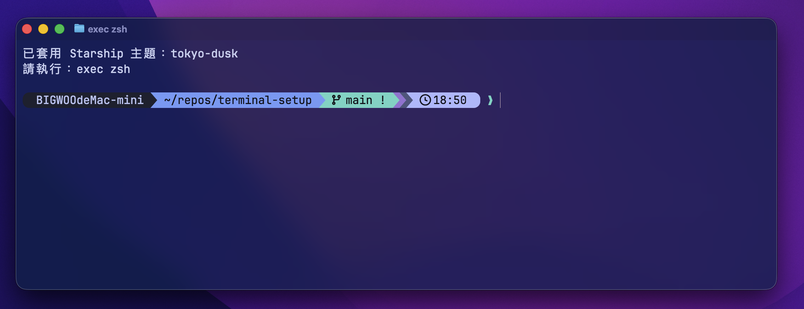
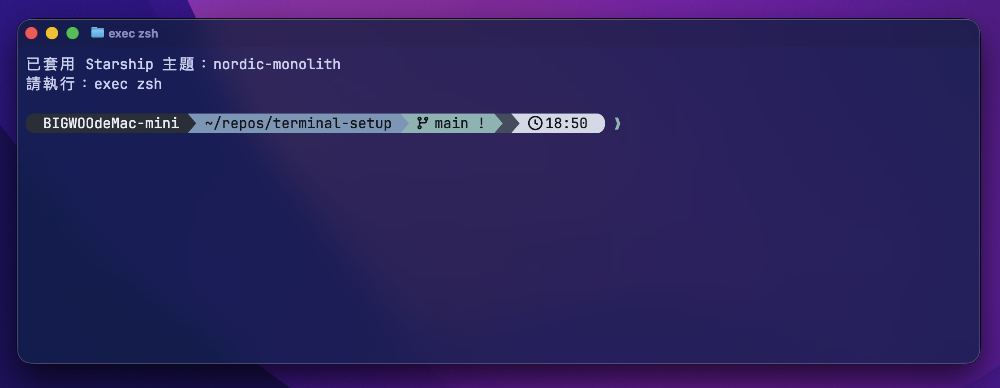
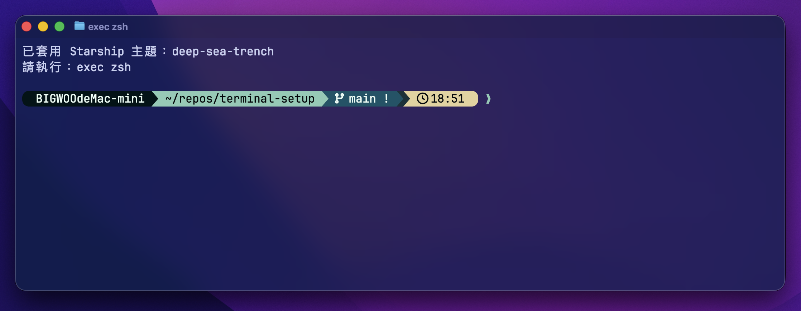
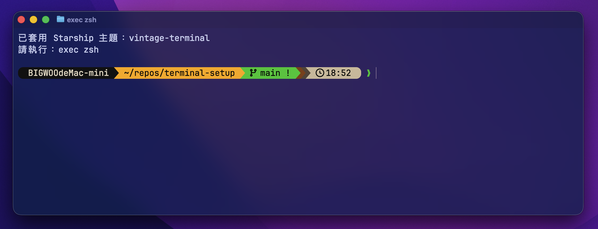

# ✨ BIGWOO Mac Terminal Setup

> 一套給開發者的炫砲終端機配置：**Ghostty + Starship + Atuin + zsh-autosuggestions**
>
> 目標很簡單：在新 Mac 上快速還原一套 **好看、順手、穩定、可分享** 的終端機環境。


---

## 🚀 特色

- **Ghostty**：快、順、漂亮，字型與留白已調過
- **Starship Prompt**：Catppuccin 風格，顯示主機、使用者、目錄、Git 狀態、語言 runtime、時間、耗時
- **Atuin**：更強的 shell history / search
- **zsh-autosuggestions**：灰字提示，指令輸入更滑順
- **可分享配置**：刻意拆掉私人憑證與機器專屬設定，方便同步到其他機器或分享給同事
- **SSH 友善**：針對 Ghostty over SSH 做了穩定性處理

---

## 🖼️ 這套配置大概長這樣

- 前景資訊：**使用者 / 主機名稱**
- 中段資訊：**當前路徑 / Git branch / Git 狀態**
- 開發資訊：**PHP / Python / Go / Rust / Java / Kotlin / Haskell / Conda**
- 尾段資訊：**當前時間 / 指令耗時**
- 外觀：**Catppuccin 配色 + Nerd Font 圖示 + Ghostty 透明度與留白**

如果你常在多台機器切來切去，`hostname` 跟 `username` 會非常有感，少踩很多坑。

---

## 📦 內容包含

```text
terminal-setup/
├─ README.md
├─ install.sh
├─ scripts/
│  └─ switch-starship-theme.sh
├─ zsh/
│  ├─ zshrc.shared
│  └─ zshrc.local.example
├─ starship/
│  ├─ starship.toml
│  └─ themes/
│     ├─ tokyo-dusk.toml
│     ├─ nordic-monolith.toml
│     ├─ deep-sea-trench.toml
│     └─ vintage-terminal.toml
└─ ghostty/
   └─ config
```

---

## ⚡ 快速安裝

### 1) 進入目錄

```bash
cd terminal-setup
```

### 2) 執行安裝腳本

```bash
bash install.sh
```

### 3) 重開 shell

```bash
exec zsh
```

---

## 🛠️ 安裝腳本會做什麼

- 檢查 / 安裝 Homebrew
- 安裝以下工具：
  - `ghostty`
  - `starship`
  - `atuin`
  - `zsh-autosuggestions`
  - `font-jetbrains-mono-nerd-font`
- 備份既有設定：
  - `~/.zshrc`
  - `~/.config/starship.toml`
  - `~/.config/ghostty/config`
- 建立共用設定檔
- 若 `~/.zshrc` 尚未載入 shared config，會自動補上

---

## 🎨 配置亮點

### Ghostty

設定檔位置：

```bash
~/.config/ghostty/config
```

目前預設：

- `font-family = "JetBrainsMono Nerd Font"`
- `font-size = 15`
- `font-feature = -calt`
- `font-thicken = true`
- `window-padding-x = 10`
- `window-padding-y = 10`
- `background-opacity = 0.85`
- `shell-integration = zsh`

### 內建 Starship 主題預覽

| Tokyo Dusk | Nordic Monolith |
|---|---|
|  |  |

| Deep Sea Trench | Vintage Terminal |
|---|---|
|  |  |

### Starship

設定檔位置：

```bash
~/.config/starship.toml
```

特色：

- 預設主題為 **03 東京黃昏**
- 顯示 `hostname`、路徑、Git branch / status、常用語言 runtime、時間與耗時
- `username` 預設低調化，不再永遠大塊顯示
- `truncation_length = 4`
- `truncate_to_repo = false`
- 內建 4 套可切換主題：`tokyo-dusk`、`nordic-monolith`、`deep-sea-trench`、`vintage-terminal`

### Zsh

共用設定檔：

```bash
~/.config/zsh/zshrc.shared
```

本機個人覆寫：

```bash
~/.config/zsh/zshrc.local
```

設計原則：

- **共用設定** 放進 `zshrc.shared`
- **私人設定** 放進 `zshrc.local`

像是 API key、公司憑證、個人 PATH、只存在某台機器上的工具鏈，全部都應該留在 local，不要進 repo。

---

## 🧠 這份 repo 為什麼值得保留

因為它不是單純「把目前 `.zshrc` 複製出來」而已。

它的重點是：

- **把真正能分享的部分抽出來**
- **把不該外流的部分留在本機**
- **讓多台 Mac 可以維持一致體驗**
- **讓新機 setup 不用重新手刻 prompt 跟 terminal 外觀**

說白一點：這是一份 **可維護、可重用、可炫耀，但不容易洩密** 的終端機配置。

---

## 🔐 安全建議

請不要把以下內容放進可分享 repo：

- API tokens
- OAuth credentials
- Google / AWS / Cloudflare secrets
- 公司內部帳號資訊
- 個人機器專屬路徑
- 只有單台機器存在的臨時工具設定

建議把這些都放進：

```bash
~/.config/zsh/zshrc.local
```

---

## 🧩 可客製項目

### 調整字體大小 / 透明度

編輯：

```bash
~/.config/ghostty/config
```

例如：

```ini
font-size = 15
background-opacity = 0.85
```

### 切換 Starship 主題

安裝完成後，會附一支 `terminal-theme` 指令。

列出可用主題：

```bash
terminal-theme list
```

切換到東京黃昏（預設）：

```bash
terminal-theme apply tokyo-dusk
```

切換其他主題：

```bash
terminal-theme apply nordic-monolith
terminal-theme apply deep-sea-trench
terminal-theme apply vintage-terminal
```

每次切換都會：

- 自動備份目前的 `~/.config/starship.toml`
- 從 `~/.config/terminal-setup/starship/themes/` 載入已安裝主題
- 套用新主題
- 提醒你執行 `exec zsh`

如果你想手動微調，再編輯：

```bash
~/.config/starship.toml
```

可自行加減：

- `nodejs`
- `php`
- `python`
- `docker_context`
- `hostname`
- `username`
- `cmd_duration`
- 其他語言 runtime 模組

### 個人環境變數 / 工具 PATH

編輯：

```bash
~/.config/zsh/zshrc.local
```

---

## 🧪 安裝後驗證

```bash
starship --version
atuin --version
zsh -ic 'echo shell ok'
```

若要確認 autosuggestion：

- 先輸入幾個你常用指令的前綴
- 應該會看到灰色建議浮出來

---

## 🤝 給團隊的使用建議

如果要給同事一起用，建議這樣分工：

- **repo**：只放共用外觀、prompt、終端機與 shell 行為設定
- **每個人自己本機**：放 API key、公司憑證、個人化 PATH
- **每個人自行微調**：字體大小、透明度、工具鏈

這樣才是真的帥：

- 有一致體驗
- 有個人彈性
- 不會酷到把秘密一起推上去

---

## 🫶 適合誰

這份配置很適合：

- 常在多台 Mac 切換的開發者
- 想把 prompt 弄得漂亮又實用的人
- 想快速複製一套開發終端機環境給自己或團隊的人
- 想要「順手、穩、乾淨、能分享」而不是一坨私人設定的人

---

## 📄 授權 / 使用方式

你可以把它當成自己的 terminal starter kit。

拿去用、拿去改、拿去變更炫都可以；只是拜託一件事：
**不要把憑證跟 secrets 一起塞進 repo，真的會哭。**
